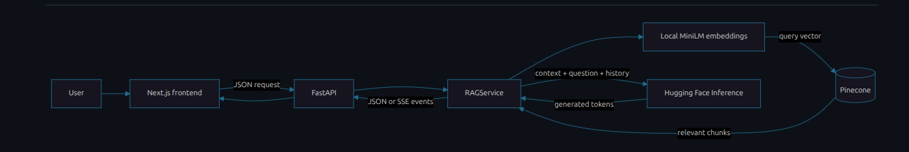

# 🩺 Medical RAG Chatbot

> **Context-aware medical question answering powered by Retrieval-Augmented Generation (RAG).**

<p align="center">
  
  
  
  
  
  
  
</p>

<p align="center">
  <b>Transform medical PDFs into a searchable semantic knowledge base and generate concise answers grounded in retrieved context.</b>
</p>

---

## ⚠️ Medical Safety Disclaimer

> **This project is intended for educational and research purposes only.**
>
> It is **not clinically validated** and must not be used as a substitute for professional medical advice, diagnosis, treatment, or emergency care.
>
> Medical information should always be verified using qualified healthcare professionals and trusted clinical sources.

---
## Project at a glance

| Area | Implementation |
|---|---|
| Frontend | Next.js 16, React, TypeScript, Tailwind CSS 4 |
| Backend API | FastAPI, Pydantic settings |
| RAG orchestration | LangChain retrieval and history-aware question answering |
| Chat model | Hugging Face Inference Providers; configured by `HF_REPO_ID` |
| Embeddings | `sentence-transformers/all-MiniLM-L6-v2` |
| Vector database | Pinecone |
| Python environment and dependencies | `uv` |
| JavaScript package manager | `pnpm` |
| Tests and quality | pytest, Ruff, mypy, Vitest, React Testing Library, Playwright |
| Containerization | Docker and Docker Compose |
| CI | GitHub Actions |

## Contents

- [🩺 Medical RAG Chatbot](#-medical-rag-chatbot)
  - [⚠️ Medical Safety Disclaimer](#️-medical-safety-disclaimer)
  - [Project at a glance](#project-at-a-glance)
  - [Contents](#contents)
  - [Capabilities](#capabilities)
  - [Architecture](#architecture)
    - [Technology responsibilities](#technology-responsibilities)
  - [Request lifecycle](#request-lifecycle)
  - [Prerequisites](#prerequisites)
  - [Configuration](#configuration)
    - [Backend environment](#backend-environment)
    - [Frontend environment](#frontend-environment)
  - [Run locally](#run-locally)
    - [1. Install and start the backend](#1-install-and-start-the-backend)
    - [2. Install and start the frontend](#2-install-and-start-the-frontend)
  - [Index medical documents](#index-medical-documents)
  - [API reference](#api-reference)
    - [Request shape](#request-shape)
    - [Non-streaming example](#non-streaming-example)
    - [Streaming example](#streaming-example)
  - [Testing and quality](#testing-and-quality)
    - [Backend](#backend)
    - [Frontend](#frontend)
  - [Docker](#docker)
  - [Deployment notes](#deployment-notes)
  - [Security and privacy](#security-and-privacy)
  - [Known limitations](#known-limitations)
  - [Troubleshooting](#troubleshooting)
  - [Contributing](#contributing)
  - [License](#license)

## Capabilities

| Capability | What it does |
|---|---|
| PDF ingestion | Extracts text and metadata from authorized medical PDFs |
| Semantic retrieval | Searches Pinecone for relevant chunks using local MiniLM embeddings |
| Context-aware follow-ups | Rewrites follow-up questions using recent conversation history |
| Streaming responses | Sends source information and generated tokens through SSE |
| Source inspection | Returns retrieved source metadata so evidence can be reviewed |
| Conversation controls | Supports stop, regenerate, retry, conversation management, and keyboard shortcuts in the UI |
| Safe rendering | Renders Markdown without allowing raw HTML through the chat renderer |
| Operational endpoints | Separates liveness from readiness checks |
| Request safeguards | Validates request data, applies rate limits, and returns user-safe error messages |

## Architecture



### Technology responsibilities

| Component | Responsibility |
|---|---|
| Next.js frontend | Chat experience, streaming display, conversation UI, source panel, and accessibility-oriented controls |
| FastAPI | Request validation, API routing, CORS, health/readiness checks, and safe error responses |
| RAG service | Query contextualization, retrieval, prompt construction, and answer generation |
| MiniLM | Converts document chunks and questions into 384-dimensional embeddings |
| Pinecone | Stores vectors and retrieves semantically relevant document chunks |
| Hugging Face Inference | Generates an answer from the question and retrieved context |

## Request lifecycle

1. The user submits a question to the frontend.
2. The frontend sends the question and, when relevant, recent conversation history to the API.
3. The backend turns follow-up questions into standalone queries before retrieval.
4. MiniLM embeds the query, and Pinecone returns the configured top-*k* chunks.
5. For streaming requests, the backend sends source information before generated token events.
6. The model receives the question and retrieved context and generates a response.
7. The API emits a completion event with conversation and latency metadata, or a safe error event if processing fails.

The application is designed to ground responses in retrieved documents. Retrieval does **not** guarantee that every generated claim is correct or fully supported.

## Prerequisites

| Tool or service | Requirement | Purpose |
|---|---|---|
| Git | Installed | Clone and manage the repository |
| Python | 3.12 | Backend runtime |
| `uv` | Current stable release | Python dependency and environment management |
| Node.js | 24 LTS recommended; meet the installed Next.js version's engine requirement | Frontend runtime and build |
| `pnpm` | Version specified by `packageManager` in `frontend/package.json`, if present | Frontend dependency management |
| Pinecone | Account and API key | Vector storage and similarity search |
| Hugging Face | Access token with Inference Providers permission | Chat model inference |
| Docker + Compose | Optional | Run services in containers |

The first backend setup may download PyTorch and the embedding model. Allow sufficient disk space and memory. CPU-only machines can use a CPU-compatible PyTorch build where supported by the project's dependency configuration.

## Configuration

### Backend environment

Create the local environment file:

```bash
cd backend
cp .env.example .env
```

Fill in the values locally. Do not commit `.env`.

| Variable | Required | Default / example | Purpose |
|---|---:|---|---|
| `PINECONE_API_KEY` | Yes | — | Authenticates with Pinecone |
| `HF_TOKEN` | Yes | — | Authenticates with Hugging Face Inference Providers |
| `PINECONE_INDEX` | No | `medical-chatbot` | Vector index name |
| `HF_REPO_ID` | No | `openai/gpt-oss-120b` | Chat model repository ID; availability depends on account and provider access |
| `EMBEDDING_MODEL` | No | `sentence-transformers/all-MiniLM-L6-v2` | Embedding model; must match the model used to index documents |
| `MAX_NEW_TOKENS` | No | `512` | Generation token limit |
| `RETRIEVER_K` | No | `3` | Number of chunks retrieved per query |
| `CORS_ORIGINS` | No | `http://localhost:3000` | Comma-separated allowed frontend origins |
| `RATE_LIMIT` | No | `20/minute` | Per-client, per-process request limit |
| `LOG_LEVEL` | No | `INFO` | Application log level |

The backend's `.env.example` and settings implementation are the source of truth if names or defaults differ. `OPENAI_API_KEY` is described as a legacy, unused setting in the supplied guide; do not add it unless the configured implementation explicitly requires it.

### Frontend environment

Create `frontend/.env.local` from the example file if present:

```bash
cd frontend
cp .env.example .env.local
```

Set the API base URL:

```dotenv
NEXT_PUBLIC_API_BASE_URL=http://localhost:8000
```

`NEXT_PUBLIC_*` values are embedded into the frontend at build time. Restart the development server or rebuild the frontend after changing this value.

## Run locally

Open separate terminals for the backend and frontend.

### 1. Install and start the backend

```bash
cd backend
uv sync --dev
```

Create `backend/.env` as described above, then ingest the documents once (see [Index medical documents](#index-medical-documents)). Start the API:

```bash
uv run uvicorn app.main:create_app --factory --reload --port 8000
```

Useful local endpoints:

| URL | Purpose |
|---|---|
| `http://localhost:8000/docs` | Interactive OpenAPI documentation |
| `http://localhost:8000/api/v1/health` | Liveness check |
| `http://localhost:8000/api/v1/ready` | Readiness check |

### 2. Install and start the frontend

In another terminal:

```bash
cd frontend
pnpm install --frozen-lockfile
pnpm dev
```

Open `http://localhost:3000`.

If your repository uses a pnpm workspace, run installation from the workspace root when required by the checked-in `pnpm-workspace.yaml` and lockfile layout. Use the package-manager version declared by the project.

## Index medical documents

1. Place PDFs you are authorized to process in `backend/data/`.
2. Confirm the backend environment contains valid Pinecone credentials and the intended index configuration.
3. Run the ingestion command from the `backend/` directory:

   ```bash
   uv run python -m app.services.ingest
   ```

4. Check the logs and Pinecone console to confirm that documents and vectors were ingested.
5. Start or restart the API after ingestion.

| Indexing setting | Value described by the project guide |
|---|---|
| Default index | `medical-chatbot` |
| Embedding model | `sentence-transformers/all-MiniLM-L6-v2` |
| Embedding dimensions | `384` |
| Similarity metric | Cosine |
| Default retrieval count | `3` |
| Chunk size / overlap | `500` / `20` characters |

**Important:** Re-running ingestion against an existing index may add duplicate vectors unless the ingestion implementation uses stable IDs or an explicit upsert/versioning strategy. Review the ingestion code before re-indexing production data. The embedding model and dimension must remain compatible with the existing index.

## API reference

The full OpenAPI schema is available at `/docs` while the backend is running.

| Method | Endpoint | Purpose |
|---|---|---|
| `POST` | `/api/v1/chat` | Returns a complete JSON answer |
| `POST` | `/api/v1/chat/stream` | Streams the response using Server-Sent Events |
| `GET` | `/api/v1/health` | Reports whether the process is alive |
| `GET` | `/api/v1/ready` | Reports whether the chain is initialized and dependencies are ready |
| `POST` | `/get` | Deprecated compatibility endpoint for the legacy Flask interface |

### Request shape

The chat endpoints accept JSON similar to:

```json
{
  "message": "What are the symptoms of diabetes?",
  "conversation_id": "optional-conversation-id",
  "history": [
    {
      "role": "user",
      "content": "What is diabetes?"
    },
    {
      "role": "assistant",
      "content": "Diabetes is a group of conditions affecting blood glucose regulation."
    }
  ]
}
```

| Field | Requirement |
|---|---|
| `message` | Required, trimmed, 1–2000 characters |
| `conversation_id` | Optional; up to 64 characters, using letters, numbers, underscores, and hyphens |
| `history` | Optional; up to 10 user/assistant turns |

The exact schema and validation rules in the running OpenAPI documentation take precedence over this summary.

### Non-streaming example

```bash
curl -s http://localhost:8000/api/v1/chat \
  -H 'Content-Type: application/json' \
  -d '{"message":"What are the symptoms of diabetes?"}' \
  | python -m json.tool
```

### Streaming example

```bash
curl -N http://localhost:8000/api/v1/chat/stream \
  -H 'Content-Type: application/json' \
  -d '{"message":"What are the symptoms of diabetes?"}'
```

The documented SSE lifecycle is:

| Event | Meaning |
|---|---|
| `sources` | Retrieved source metadata |
| `token` | A generated text fragment; may occur multiple times |
| `done` | Completion metadata, including conversation ID and latency |
| `error` | A user-safe error when generation cannot complete |

## Testing and quality

Run the repository's verification script if it is present:

```bash
./verify.sh
```

The supplied guide describes support for `./verify.sh backend`, `./verify.sh frontend`, and `./verify.sh --e2e`. Confirm the script's current usage before relying on optional arguments.

### Backend

Run from `backend/`:

```bash
uv sync --dev
uv run ruff check .
uv run ruff format --check .
uv run mypy
uv run pytest
```

The documented test suite uses a fake RAG chain for API behavior, so most tests should not require live model inference or Pinecone access. Check the current `pyproject.toml` for coverage thresholds and tool configuration.

### Frontend

Run from `frontend/`:

```bash
pnpm install --frozen-lockfile
pnpm run typecheck
pnpm run lint
pnpm test
pnpm run build
```

For end-to-end tests, install the required Playwright browser and run the script defined in `frontend/package.json`, for example:

```bash
pnpm exec playwright install chromium
pnpm run e2e
```

Use the actual script names in `package.json` if they differ. A successful dependency install is not the same as passing tests; run the quality gates before deployment.

## Docker

If the repository includes the described `compose.yaml` or `docker-compose.yml` and the corresponding Dockerfiles, configure the backend environment first:

```bash
cp backend/.env.example backend/.env
```

Then build and start the services from the repository root:

```bash
docker compose up --build
```

| Service | Local address |
|---|---|
| Frontend | `http://localhost:3000` |
| Backend API docs | `http://localhost:8000/docs` |

Useful commands:

```bash
docker compose logs -f backend
docker compose down
```

Document ingestion is a separate operation unless the current Compose configuration explicitly runs it. Ensure `backend/data/` is mounted or otherwise available to the ingestion process; do not assume PDFs are included in the application image.

## Deployment notes

The supplied deployment guide describes a possible production topology:

| Component | Suggested destination | Considerations |
|---|---|---|
| Frontend | Vercel or AWS Amplify | Set `NEXT_PUBLIC_API_BASE_URL` to the public API URL at build time |
| Backend | AWS ECS Fargate behind an Application Load Balancer | Configure health checks, sufficient memory, HTTPS, and SSE-compatible idle timeouts |
| Container registry | Amazon ECR | Use immutable image tags and image scanning |
| Secrets | AWS Secrets Manager or an equivalent managed store | Never bake secrets into images or task definitions |
| CI/CD authentication | GitHub Actions OIDC to AWS IAM | Prefer short-lived credentials and least-privilege permissions |

Deployment is **not implied to be active or production-verified** by this documentation. Before publishing, configure CORS for the exact deployed frontend origin, verify health/readiness checks, and test streaming through the complete proxy/load-balancer path.

## Security and privacy

| Area | Required practice |
|---|---|
| API keys | Keep `PINECONE_API_KEY` and `HF_TOKEN` in local ignored environment files or a managed secret store |
| Git | Never commit `.env`, `.env.local`, tokens, credentials, or confidential source documents |
| Exposed credentials | Revoke and rotate any key that has been committed, shared, or otherwise exposed; review repository history if needed |
| Permissions | Use least-privilege IAM and narrowly scoped provider tokens |
| Medical documents | Only ingest content you are authorized to process; do not use identifiable patient data without the necessary security, legal, and institutional approvals |
| API exposure | Configure CORS, rate limits, HTTPS, monitoring, and appropriate access controls before public deployment |
| Logs | Avoid logging secrets, sensitive medical queries, or patient-identifying information |

## Known limitations

- This is an educational/research system, not a clinically validated medical product.
- Retrieval quality depends on document quality, chunking, indexing, and query formulation.
- A retrieved passage can be irrelevant or incomplete, and a language model can still produce unsupported claims.
- Model availability, throughput, and free-tier inference limits depend on the selected Hugging Face provider and account.
- Local embedding initialization may download model files and consume significant memory.
- Duplicate ingestion can degrade retrieval quality if the indexing workflow does not handle stable IDs or updates.
- Deployment instructions describe a target architecture; the deployed infrastructure and its security posture must be verified independently.
- No benchmark accuracy or clinical performance result is claimed here.

## Troubleshooting

| Symptom | Likely cause | What to check |
|---|---|---|
| `uv sync --dev` fails | Missing or inconsistent project metadata or lockfile | Confirm `backend/pyproject.toml` and `backend/uv.lock` are present and synchronized |
| `pnpm install --frozen-lockfile` fails | Lockfile is missing or out of sync | Run the appropriate `pnpm install` locally, review changes, and commit the updated lockfile |
| Missing Python module | Dependency is absent from project metadata or the wrong environment is active | Add the dependency to `pyproject.toml`, update `uv.lock`, then run `uv sync --dev` |
| Pinecone authentication error | Invalid, revoked, or missing key | Check `PINECONE_API_KEY` in `backend/.env` and the Pinecone console |
| Hugging Face inference error | Invalid token, model/provider unavailable, or quota exhausted | Check `HF_TOKEN`, `HF_REPO_ID`, provider availability, and account limits |
| Index dimension mismatch | Index created with a different embedding model/dimension | Verify `EMBEDDING_MODEL`, the index dimension, and ingestion configuration |
| Frontend cannot reach API | Wrong API URL or CORS origin | Check `NEXT_PUBLIC_API_BASE_URL`, `CORS_ORIGINS`, and restart/rebuild after env changes |
| Stream stops behind a proxy | Proxy buffering or idle timeout | Verify SSE is not buffered and configure a suitable upstream/load-balancer timeout |
| Readiness check fails | RAG chain is not initialized or a required service is unreachable | Inspect backend logs, credentials, Pinecone access, and model initialization |
| CI cannot find dependencies | Workflow runs in the wrong directory or installs with the wrong package manager | Check job working directories and use `uv` for backend and `pnpm` for frontend |

## Contributing

1. Create a feature branch.
2. Make a focused change.
3. Run the relevant backend or frontend quality checks.
4. Update documentation when behavior or configuration changes.
5. Open a pull request describing the motivation, implementation, tests, and known limitations.

```bash
git checkout -b feature/your-change
git add .
git commit -m "feat: describe your change"
git push origin feature/your-change
```

## License

No license is specified in the supplied project notes. Until a `LICENSE` file is added, do not assume the repository is released under an open-source license.

---

<p align="center">
  <strong>Retrieve · Ground · Generate</strong><br/>
  <sub>Built for learning and experimentation. Not for clinical decision-making.</sub>
</p>