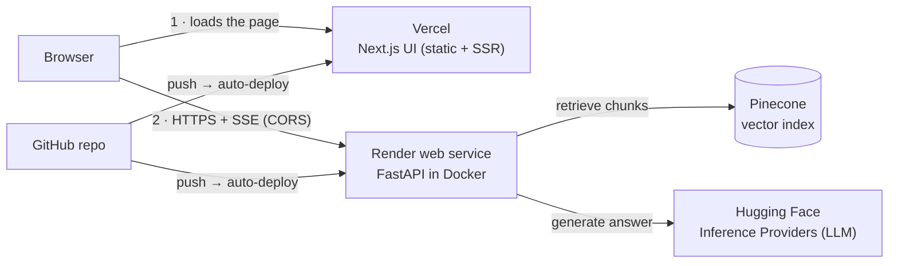

# Deploy guide — Render (API) + Vercel (UI)

Take the Medical RAG Chatbot from your laptop to a public URL: the **FastAPI backend on Render** (Docker) and the **Next.js frontend on Vercel**, with Pinecone and Hugging Face as the managed services behind it.

> **What was and wasn't checked.** This guide was written without access to your Render or Vercel accounts, so nothing here was deployed. What *was* checked: every variable name against `backend/app/core/config.py`; `render.yaml` parses as YAML; the uvicorn behaviour this guide relies on (`FORWARDED_ALLOW_IPS`, `--workers`) against uvicorn's source; and the platform facts (plans, limits, health checks, ports, env vars) against Render's and Vercel's docs as of October 2026 — see [Sources](#sources). If a dashboard label has moved, the *field names* in this guide are what to look for.

For local setup, keys, ingestion, tests and the AWS alternative, see [`guide.md`](guide.md).

---

## Contents

1. [How it fits together](#1-how-it-fits-together)
2. [Pick a Render plan first (memory matters)](#2-pick-a-render-plan-first-memory-matters)
3. [Step 1 — Keys and one-time ingestion](#3-step-1--keys-and-one-time-ingestion)
4. [Step 2 — Push the project to GitHub](#4-step-2--push-the-project-to-github)
5. [Step 3 — Deploy the API on Render](#5-step-3--deploy-the-api-on-render)
6. [Step 4 — Deploy the UI on Vercel](#6-step-4--deploy-the-ui-on-vercel)
7. [Step 5 — Connect them (CORS) and test end to end](#7-step-5--connect-them-cors-and-test-end-to-end)
8. [Step 6 — Custom domains (optional)](#8-step-6--custom-domains-optional)
9. [Operating it](#9-operating-it)
10. [Troubleshooting](#10-troubleshooting)
11. [Final checklist](#11-final-checklist)
12. [Sources](#sources)

**The whole thing in six lines**

```text
1. Rotate keys, ingest the PDF into Pinecone (once, from your laptop)
2. git push the repo to GitHub (private)
3. Render → New → Blueprint → this repo → enter PINECONE_API_KEY, HF_TOKEN → wait for "Live"
4. Vercel → Import repo → Root Directory = frontend → NEXT_PUBLIC_API_BASE_URL = <Render URL> → Deploy
5. Render → Environment → CORS_ORIGINS = <Vercel URL> → save (auto-redeploys)
6. Open the Vercel URL and ask a question
```

---

## 1. How it fits together



- The **browser calls the API directly**. The UI never proxies chat traffic, so the API must allow the UI's origin via CORS (Step 5).
- `NEXT_PUBLIC_API_BASE_URL` is **baked into the JavaScript at build time** on Vercel. Changing it later requires a new Vercel deployment, not just a restart.
- The API loads the embedding model and connects to Pinecone **before it accepts connections** (FastAPI `lifespan`), so a fresh deploy takes a while to become healthy. That is normal.
- Ingestion is a **one-time job you run locally**. Pinecone is hosted, so the same index serves local development and production.

### What it costs

| Piece | Plan | Cost |
| --- | --- | --- |
| Render web service | Standard — 1 CPU, 2 GB RAM | **$25 / month**, billed prorated to the second |
| Vercel | Hobby | $0 — intended for personal, non-commercial projects |
| Pinecone | Starter | $0 |
| Hugging Face | Inference Providers | Free monthly credits, then pay-as-you-go — check your billing page |

Prices are from render.com/pricing in October 2026. You can suspend or delete the Render service whenever you are not using it.

---

## 2. Pick a Render plan first (memory matters)

This is the one decision that can sink the deployment, so it comes first.

| Render plan | RAM | Spins down when idle? | Fits this API? |
| --- | --- | --- | --- |
| Free | 512 MB | Yes — after 15 min without traffic; about a minute to wake | **Very likely not** |
| Starter ($7) | 512 MB | No | **Very likely not** |
| **Standard ($25)** | **2 GB** | No | **Yes — recommended** |

Why 512 MB is a problem: the API process holds PyTorch, the `all-MiniLM-L6-v2` embedding model, LangChain, the Pinecone client and the web server in memory. I could not measure the exact footprint here (the sandbox this was prepared in has no package-registry access), so treat "very likely not" as an informed estimate: a PyTorch-based process alone commonly uses several hundred MB. **Measure it yourself** after deploying: Render dashboard → your service → **Metrics → Memory**.

`render.yaml` therefore uses **Standard** and runs **one** uvicorn worker. The Dockerfile's default of two workers would load the model twice.

If you want to run on Free or Starter anyway, read [§9.5](#95-running-on-the-free-plan).

---

## 3. Step 1 — Keys and one-time ingestion

Do this on your own machine. Full details are in [`guide.md` §3–4](guide.md); the short version:

1. **Rotate the keys that came in the original zip.** The old `.env` contained real credentials — treat them as compromised. Create a new Pinecone key and a new Hugging Face token, delete the old ones ([`guide.md` §3.4](guide.md)).
2. **Hugging Face token:** fine-grained, with only **"Make calls to Inference Providers"**. Confirm `openai/gpt-oss-120b` is available to your account on the model page; otherwise pick another chat model and set `HF_REPO_ID`.
3. **Create `backend/.env`** from `backend/.env.example` with the new keys.
4. **Ingest the PDF** (creates the `medical-chatbot` index: 384 dimensions, cosine, serverless AWS `us-east-1`):

   ```bash
   cd backend
   python -m venv .venv && source .venv/bin/activate      # Windows: .venv\Scripts\activate
   pip install torch --index-url https://download.pytorch.org/whl/cpu   # optional: smaller CPU-only build
   pip install -r requirements.txt
   python -m app.services.ingest
   ```

   Check the Pinecone console → *Indexes → medical-chatbot*: the record count should be non-zero and records should carry `text`, `source` and `page` metadata. Re-running ingestion against an existing index **adds duplicates**, so delete the index first if you need to redo it.

5. **Smoke-test locally before deploying**, so the first Render build is not the first time the code runs:

   ```bash
   cd ..                       # project root
   ./verify.sh                 # lint, types, tests, build — writes verify-report.txt
   docker compose up --build   # UI http://localhost:3000, API docs http://localhost:8000/docs
   ```

> **Why ingest locally?** A Render shell and one-off jobs are paid features, and ingestion needs the PDF — which `backend/.dockerignore` deliberately keeps *out* of the Docker image. Running it once from your laptop is simpler and gives the same result.

---

## 4. Step 2 — Push the project to GitHub

Render and Vercel both deploy from a Git repository.

```bash
cd medical-chatbot            # the project root (contains backend/, frontend/, render.yaml)

# Make the frontend install reproducible. Vercel installs from package-lock.json when it exists.
(cd frontend && npm install)

git init -b main
git add .
git status                    # review: there must be NO .env file and NO node_modules/
git ls-files | grep -E '(^|/)\.env$'    # must print nothing
git commit -m "Medical RAG chatbot"
```

Create an **empty private repository** on github.com (no README, no .gitignore), then:

```bash
git remote add origin https://github.com/<your-username>/medical-chatbot.git
git push -u origin main
```

> **Keep the repo private** unless you have checked the licence of the PDF in `backend/data/` — a medical textbook is often copyrighted. Both Render and Vercel can deploy private GitHub repositories after you grant them access.

> **If a secret ever reached a Git remote**, deleting it in a later commit is not enough — it stays in history. Rotate it, and consider the repo tainted.

---

## 5. Step 3 — Deploy the API on Render

### Option A — Blueprint (recommended)

`render.yaml` at the repo root describes the whole service, so there is nothing to click through by hand.

1. Sign up at <https://render.com> and connect your GitHub account.
2. **New → Blueprint**, choose your repository, and let Render read `render.yaml`.
3. Render prompts for the variables marked `sync: false`:

   | Variable | Enter |
   | --- | --- |
   | `PINECONE_API_KEY` | the **new** Pinecone key |
   | `HF_TOKEN` | the **new** Hugging Face token |
   | `CORS_ORIGINS` | `http://localhost:3000` for now — you replace it in Step 5 |

4. **Apply**. Render builds the image and starts the service. The **first build is the slow one** (PyTorch and the embedding model are baked into the image); later builds reuse cached layers.
5. When the service shows **Live**, copy its URL — `https://medical-chatbot-api.onrender.com` or similar. You need it for Step 4.

### Option B — Manual setup (same result)

**New → Web Service →** your repo, then:

| Field | Value |
| --- | --- |
| Language / runtime | **Docker** |
| Dockerfile path | `./backend/Dockerfile` (relative to the repo root) |
| Docker build context | `./backend` |
| Region | Virginia (closest to Pinecone `us-east-1` and the Hugging Face API) |
| Instance type | **Standard** (2 GB) — see [§2](#2-pick-a-render-plan-first-memory-matters) |
| Docker command | `uvicorn app.main:create_app --factory --host 0.0.0.0 --port 8000 --workers 1 --proxy-headers` |
| Health check path | `/api/v1/health` |
| Auto-deploy | On commit |

Then add the environment variables:

### Environment variables on Render

| Variable | Value | Why |
| --- | --- | --- |
| `PINECONE_API_KEY` | secret | Required — the API will not start without it |
| `HF_TOKEN` | secret | Required |
| `CORS_ORIGINS` | your Vercel URL(s), comma-separated | Exact match including `https://`, **no trailing slash** |
| `PORT` | `8000` | Tells Render which port to look for. Render's default is `10000`; this image listens on `8000` |
| `FORWARDED_ALLOW_IPS` | `*` | Lets uvicorn trust Render's `X-Forwarded-For`. Without it **every visitor appears to come from the proxy's IP and shares one rate-limit bucket** |
| `ENVIRONMENT` | `production` | |
| `LOG_LEVEL` | `INFO` | JSON logs to stdout |
| `RATE_LIMIT` | `20/minute` | Per client IP, per process |
| `PINECONE_INDEX` | `medical-chatbot` | Must match the index you ingested into |
| `HF_REPO_ID`, `MAX_NEW_TOKENS`, `RETRIEVER_K` | *(optional)* | Defaults are in `config.py` |

> **Don't change `EMBEDDING_MODEL`** on Render. The image bakes in the default model at build time, and the index was built with it. A different model must be re-ingested *and* rebuilt.

### Why these settings

- **`--workers 1`** — one copy of the model in memory, and the in-process rate limiter is accurate. The `CMD` in the Dockerfile uses two workers, so the Docker command is overridden.
- **Health check = `/api/v1/health`, not `/ready`.** `/health` is liveness only. `/ready` calls Pinecone, and Render checks every few seconds.
- **How Render judges health:** a check must answer within **5 seconds** with a `2xx`/`3xx`; after **60 seconds** of consecutive failures it restarts the instance; if a new deploy is not healthy within **15 minutes**, the deploy is cancelled. Because the model loads before the port opens, a healthy deploy typically takes a minute or so after the build — watch the logs the first time.

### Verify the API

```bash
API=https://medical-chatbot-api.onrender.com       # your URL

curl -s $API/api/v1/health      # {"status":"ok","index":null}
curl -s $API/api/v1/ready       # {"status":"ready","index":"medical-chatbot"}  → Pinecone is reachable

# Streaming answer (-N turns off curl's buffering so you see events arrive):
curl -N -X POST $API/api/v1/chat/stream \
  -H 'Content-Type: application/json' \
  -d '{"message":"What are the symptoms of diabetes?"}'
# expect:  event: sources → several event: token → event: done
```

Interactive API docs are at `$API/docs`.

---

## 6. Step 4 — Deploy the UI on Vercel

The repo holds two projects (`backend/` and `frontend/`), so tell Vercel which folder is the web app.

1. Sign up at <https://vercel.com> with GitHub.
2. **Add New… → Project**, choose your repository, **Import**.
3. Next to **Root Directory**, click **Edit** and select **`frontend`**. Vercel detects **Next.js** automatically; leave the build and install commands at their defaults.
4. Open **Environment Variables** and add:

   | Name | Value | Environments |
   | --- | --- | --- |
   | `NEXT_PUBLIC_API_BASE_URL` | `https://medical-chatbot-api.onrender.com` (your Render URL, **`https://`**, no trailing slash) | Production, Preview |

5. **Deploy**. When it finishes, copy the production URL, for example `https://medical-chatbot.vercel.app`.

> **Why `https://`?** The page is served over HTTPS; browsers block calls from an HTTPS page to an `http://` API ("mixed content"). Render's URLs are HTTPS already.

> **Env-var changes only apply to new deployments.** If you edit `NEXT_PUBLIC_API_BASE_URL` later, open **Deployments → ⋯ → Redeploy**. A restart is not enough, because the value is compiled into the bundle.

**CLI alternative** (optional):

```bash
npm i -g vercel
cd frontend
vercel login
vercel                                          # first run: link/create the project (answer the prompts)
vercel env add NEXT_PUBLIC_API_BASE_URL production   # paste the Render URL
vercel --prod
```

`frontend/next.config.ts` only enables `output: "standalone"` when it is *not* running on Vercel; that option exists for the Docker image and Vercel doesn't need it.

---

## 7. Step 5 — Connect them (CORS) and test end to end

The API only answers browsers whose origin it has been told about.

1. Render dashboard → your service → **Environment** → set

   ```text
   CORS_ORIGINS=https://medical-chatbot.vercel.app
   ```

   - Include **every URL you will open the site from**, comma-separated: `https://medical-chatbot.vercel.app,https://chat.yourdomain.com`.
   - Match exactly: scheme included, **no trailing slash**, no wildcard.
   - Saving restarts the service with the new value.

2. **Check the preflight from your terminal** (this is what the browser does before the first chat request):

   ```bash
   curl -si -X OPTIONS $API/api/v1/chat/stream \
     -H 'Origin: https://medical-chatbot.vercel.app' \
     -H 'Access-Control-Request-Method: POST' \
     -H 'Access-Control-Request-Headers: content-type' | grep -i '^access-control'
   # expect: access-control-allow-origin: https://medical-chatbot.vercel.app
   ```

   No `access-control-allow-origin` line means the origin does not match `CORS_ORIGINS` exactly.

3. **Open the Vercel URL** and ask "What are the symptoms of diabetes?". You should see the answer stream in, with a **Sources** panel listing book pages.
4. In DevTools → **Network**, the `chat/stream` request should be `200`, type `fetch`, content-type `text/event-stream`.

> **Preview deployments** (Vercel builds for pull requests and non-production branches) get a different URL each time, so they are **blocked by CORS** unless you add that exact URL to `CORS_ORIGINS`. For a personal project, test on Production, or add the specific preview URL temporarily.

---

## 8. Step 6 — Custom domains (optional)

1. **Vercel:** project → **Settings → Domains** → add `chat.yourdomain.com` and create the DNS record Vercel shows.
2. **Render:** service → **Settings → Custom Domains** → add `api.yourdomain.com` and create the DNS record Render shows. TLS certificates are issued automatically.
3. Update both sides, then redeploy:
   - Vercel `NEXT_PUBLIC_API_BASE_URL=https://api.yourdomain.com` → **Redeploy**
   - Render `CORS_ORIGINS=https://chat.yourdomain.com` (keep the `.vercel.app` URL too if you still use it)

---

## 9. Operating it

### 9.1 Deploying changes

`git push origin main` redeploys both: Render rebuilds the API (`autoDeployTrigger: commit`) and Vercel rebuilds the UI. Render keeps the old instance running until the new one passes its health check (zero-downtime deploys).

### 9.2 Rolling back

- **Render:** service → **Events** (deploy history) → roll back to an earlier successful deploy.
- **Vercel:** **Deployments** → open an older production deployment → **Promote to Production** (or Instant Rollback).

### 9.3 Logs and tracing a bad answer

- Render → **Logs**. The API writes JSON lines with secrets redacted, including the request ID.
- Every API response carries an `X-Request-ID` header. From the browser's Network tab, copy it and search the Render logs for it to see exactly what happened for that request.
- Upstream failures (Hugging Face or Pinecone) appear as `chat_stream_failed` or `Readiness probe failed` with a stack trace; the browser only ever sees a generic message.

### 9.4 Rotating keys

Create the new key → update it in Render **Environment** (saving restarts the service) → delete the old key at the provider. Nothing needs to change on Vercel; the frontend holds no secrets. **Never put `PINECONE_API_KEY` or `HF_TOKEN` in a `NEXT_PUBLIC_*` variable** — those are shipped to every visitor's browser.

### 9.5 Running on the Free plan

Free (512 MB) is attractive for a portfolio, but expect problems:

- **Memory.** As in [§2](#2-pick-a-render-plan-first-memory-matters), the API is unlikely to fit. If you try it (set `plan: free` in `render.yaml`, or choose Free in the dashboard), watch **Metrics → Memory** and the **Events** tab for out-of-memory restarts.
- **Sleeping.** After 15 minutes without traffic the service spins down; the next visitor waits about a minute for it to wake **plus** the model-load time. Free instances also share 750 instance-hours per month.
- **A way to make it fit** is to stop running PyTorch inside the API: compute query embeddings through a hosted embedding endpoint serving the *same* 384-dimension model (so the existing Pinecone index stays valid). That is a change to `backend/app/services/rag.py` and `requirements.txt` which has **not** been made here — ask for it if you want it, and confirm the model is available on Hugging Face's inference providers first.

### 9.6 Controlling cost

Suspend the Render service from its **Settings** when you do not need it (billing is per second), or delete it. Set spending limits or alerts in the Hugging Face and Pinecone consoles. The built-in limiter (`RATE_LIMIT`, per IP) is best-effort protection, not a spending cap.

### 9.7 Pin your backend dependencies

`backend/requirements.txt` uses version *ranges*, so a rebuild next month can pull newer packages than you tested. Once the local install works: `pip freeze > requirements.txt`, test, commit.

---

## 10. Troubleshooting

| Symptom | Likely cause | Fix |
| --- | --- | --- |
| Browser console: *"blocked by CORS policy"* | The page's origin is not in `CORS_ORIGINS`, or differs by `http`/`https`, a trailing slash or a preview URL | Fix `CORS_ORIGINS` on Render and save; re-run the preflight `curl` in Step 5 |
| UI shows a connection error and the Network tab calls `localhost:8000` | `NEXT_PUBLIC_API_BASE_URL` was not set when Vercel built the site | Set it for Production/Preview, then **Redeploy** |
| Requests blocked as *mixed content* | The API URL starts with `http://` | Use the `https://` Render URL |
| Render: *"No open HTTP ports detected"* | `PORT` and `--port` disagree, or the app is not listening on `0.0.0.0` | Keep `PORT=8000` and `--port 8000 --host 0.0.0.0` together; check the logs for a startup crash |
| Render: deploy cancelled / never becomes healthy | The API crashed at startup (missing or invalid `PINECONE_API_KEY`/`HF_TOKEN`, Pinecone unreachable) or the 15-minute health window passed | Read the logs: pydantic prints which variable is missing |
| Service restarts under load; Events show out-of-memory | Plan too small, or two workers running | Standard plan and `--workers 1` ([§2](#2-pick-a-render-plan-first-memory-matters)) |
| `/api/v1/ready` returns `503` | Pinecone key wrong, index name wrong, or the index does not exist | Check `PINECONE_INDEX`; confirm the index exists in the Pinecone console |
| Answers say "I couldn't find that…" and show no sources | The index is empty, or was built with a different embedding model | Run ingestion again on a fresh index ([§3](#3-step-1--keys-and-one-time-ingestion)) |
| `429 rate_limited` for everyone almost immediately | `FORWARDED_ALLOW_IPS` is not set, so all visitors share the proxy's IP | Set `FORWARDED_ALLOW_IPS=*` |
| Stream ends with *"The assistant is unavailable right now"* | Hugging Face rejected the call — token permission, model not available to you, or credits used up | Look for `chat_stream_failed` in the Render logs; check the token scope, `HF_REPO_ID` and your HF billing |
| Render build fails during `pip install` | A newer dependency release broke a range in `requirements.txt` | Pin versions ([§9.7](#97-pin-your-backend-dependencies)) |
| Vercel build fails on `npm install` | No lockfile and a flaky resolve, or Node too old | Commit `package-lock.json` (Step 2); the project needs Node ≥ 20.9 |
| First request after a long idle is very slow | Free plan spin-down | Use a paid plan ([§9.5](#95-running-on-the-free-plan)) |

---

## 11. Final checklist

**Secrets**
- [ ] Old Pinecone and Hugging Face keys from the original zip are revoked; new ones are in use
- [ ] `git ls-files | grep -E '(^|/)\.env$'` prints nothing; repository is private
- [ ] Keys exist only in Render's Environment tab (and your local, git-ignored `.env`) — none in `NEXT_PUBLIC_*`

**Backend (Render)**
- [ ] Plan is Standard (2 GB); one worker; `PORT=8000`; `FORWARDED_ALLOW_IPS=*`
- [ ] `/api/v1/health` → `ok`, `/api/v1/ready` → `ready`
- [ ] `CORS_ORIGINS` lists exactly the origins that serve the UI

**Frontend (Vercel)**
- [ ] Root Directory is `frontend`; `NEXT_PUBLIC_API_BASE_URL` is the `https://` API URL
- [ ] A question streams an answer with sources, in a real browser, on the production URL

**Medical-safety**
- [ ] The "educational use only — not medical advice" banner is visible
- [ ] The emergency notice appears for a message like "severe chest pain"

---

## Sources

- Render — [Free web services](https://render.com/docs/free) (512 MB, 750 instance-hours/month, spin-down after 15 minutes)
- Render — [Pricing](https://render.com/pricing) (Starter 512 MB $7, Standard 1 CPU / 2 GB $25; billing prorated to the second)
- Render — [Blueprint spec](https://render.com/docs/blueprint-spec) (`runtime: docker`, `dockerfilePath`, `dockerContext`, `dockerCommand`, `plan`, `region`, `healthCheckPath`, `autoDeployTrigger`, `sync: false`)
- Render — [Health checks](https://render.com/docs/health-checks) (5-second timeout, 60-second restart rule, 15-minute deploy limit)
- Render — [Port binding](https://render.com/tutorials/when-deploys-go-wrong/boot-and-port-binding) (`PORT`, default 10000, bind to `0.0.0.0`)
- Vercel — [Monorepos](https://vercel.com/docs/monorepos) (Root Directory)
- Vercel — [Environment variables](https://vercel.com/docs/environment-variables) (changes apply to new deployments only)
