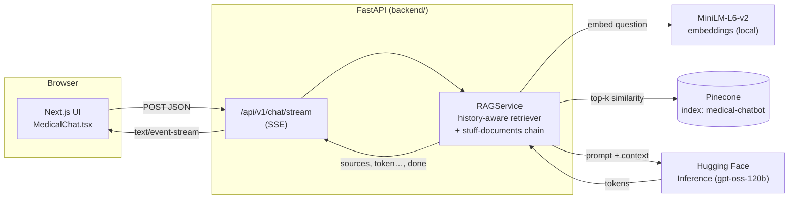

# Medical RAG Chatbot — Setup, Connection & Deployment Guide

FastAPI backend · Next.js 16 + Tailwind CSS 4 frontend · Pinecone vector search · Hugging Face LLM

> **Educational use only.** This system is not clinically validated and must not replace professional medical advice, diagnosis or treatment. In an emergency call your local emergency number.

> **Build status — read first.** This project was authored in an environment with no access to the npm / PyPI registries, so the code was **not installed, built or executed** there. It was syntax-checked and the Python was linted with `ruff`. Dependency versions are therefore *ranges*, not pins. On your machine, run the quality gates in [§7](#7-testing--quality) **before** trusting it, then lock versions (`pip freeze`, `package-lock.json`). Anything that fails is most likely a version-drift detail, and [§10](#10-troubleshooting) lists the likely suspects.

---

## Contents

1. [Architecture](#1-architecture)
2. [Prerequisites](#2-prerequisites)
3. [Accounts & keys](#3-accounts--keys)
4. [Backend setup (FastAPI)](#4-backend-setup-fastapi)
5. [Frontend setup (Next.js)](#5-frontend-setup-nextjs)
6. [Docker & docker-compose](#6-docker--docker-compose)
7. [Testing & quality](#7-testing--quality)
8. [Deploying to AWS](#8-deploying-to-aws)
9. [Migration notes: Flask → FastAPI](#9-migration-notes-flask--fastapi)
10. [Troubleshooting](#10-troubleshooting)
11. [Security, medical-safety & production-readiness checklists](#11-checklists)

---

## 1. Architecture



**Request flow**

1. The user submits a question. The browser `POST`s `{message, conversation_id, history}` to `/api/v1/chat/stream`.
2. For follow-ups ("How is it treated?") the chain first rewrites the question into a standalone query using the history, then embeds it locally with `all-MiniLM-L6-v2` (384 dims).
3. Pinecone returns the top‑k chunks (`k=3` by default). The backend immediately emits a `sources` SSE event.
4. The chunks + history + system prompt go to the Hugging Face model; tokens stream back as `token` events and the UI renders them as Markdown as they arrive.
5. A final `done` event carries `conversation_id` and `latency_ms`. Any failure becomes a user-safe `error` event (no stack traces leave the server).

**Repo layout**

```
backend/   FastAPI app (app/), tests, Dockerfile, ingestion CLI, data/Medical_book.pdf
frontend/  Next.js 16 app (src/), unit tests (vitest), e2e (playwright)
legacy/    The original Flask app (delete once you've verified the new stack)
guide.md   this file
```

### API reference (summary — full OpenAPI at `/docs`)

| Method & path | Purpose |
| --- | --- |
| `POST /api/v1/chat` | One JSON answer: `{answer, sources[], conversation_id, latency_ms}` |
| `POST /api/v1/chat/stream` | Same input, answered as Server‑Sent Events: `sources` → `token`* → `done` (or `error`) |
| `GET /api/v1/health` | Liveness (process is up) |
| `GET /api/v1/ready` | Readiness (chain loaded **and** Pinecone reachable) |
| `POST /get` | **Deprecated** Flask-compatible endpoint (form field `msg`, plain-text reply) |

Request body: `message` 1–2000 chars (whitespace-trimmed), optional `conversation_id` (`[A-Za-z0-9_-]`, ≤ 64), optional `history` (≤ 10 turns of `{role: "user"|"assistant", content}`). Errors always look like `{"error": {"code": "...", "message": "..."}}`.

---

## 2. Prerequisites

| Tool | Version | Check |
| --- | --- | --- |
| Python | 3.12+ (3.13 works if all wheels exist) | `python --version` |
| Node.js | 20.9+ (22 LTS recommended; Next.js 16 requires ≥ 20.9) | `node --version` |
| npm | 10+ | `npm --version` |
| Docker + Compose v2 | optional but recommended | `docker compose version` |
| Git | any | `git --version` |

**OS notes**

- **Windows:** use PowerShell or WSL2. Activate the venv with `.venv\Scripts\Activate.ps1` (you may need `Set-ExecutionPolicy -Scope CurrentUser RemoteSigned`). Docker Desktop with the WSL2 backend is the smoothest path.
- **macOS:** `brew install python@3.12 node@22`. Apple‑silicon works; PyTorch ships arm64 wheels.
- **Linux:** the first `pip install` pulls PyTorch (large). For CPU-only machines use the CPU wheel index (see §4.1) to save ~2 GB.
- Plan for **~4 GB RAM** for the backend (PyTorch + the embedding model) and ~3 GB of disk.

---

## 3. Accounts & keys

### 3.1 Pinecone (vector database)

1. Sign up at <https://www.pinecone.io> (the free *Starter* plan is enough).
2. Console → **API keys** → copy the default key (starts with `pcsk_…`).
3. You do **not** need to create the index manually: `python -m app.services.ingest` creates `medical-chatbot` (dimension **384**, metric **cosine**, serverless AWS `us-east-1`) if it doesn't exist.

### 3.2 Hugging Face (LLM)

1. Sign up at <https://huggingface.co> → **Settings → Access Tokens → Create new token**.
2. Use a **fine‑grained** token with only the permission **"Make calls to Inference Providers"**. Read-only scope on repos is not needed.
3. Open the model page for `openai/gpt-oss-120b` and check that it is available through *Inference Providers* for your account/plan (free monthly credits are limited). If not, set another chat-capable model in `HF_REPO_ID`.

### 3.3 Configure the backend

```bash
cd backend
cp .env.example .env     # Windows: copy .env.example .env
```

`backend/.env.example`, line by line:

| Variable | Required | Default | Meaning |
| --- | --- | --- | --- |
| `PINECONE_API_KEY` | ✅ | – | Pinecone key from §3.1 |
| `HF_TOKEN` | ✅ | – | Hugging Face token from §3.2 |
| `PINECONE_INDEX` | | `medical-chatbot` | Index name used by both ingestion and the API |
| `HF_REPO_ID` | | `openai/gpt-oss-120b` | Model served via Hugging Face |
| `EMBEDDING_MODEL` | | `sentence-transformers/all-MiniLM-L6-v2` | **Must match** the model used at ingestion (384 dims) |
| `MAX_NEW_TOKENS` | | `512` | Generation cap (the legacy app cut answers at 200) |
| `RETRIEVER_K` | | `3` | Chunks retrieved per question |
| `CORS_ORIGINS` | | `http://localhost:3000` | Comma-separated browser origins allowed to call the API |
| `RATE_LIMIT` | | `20/minute` | Per client IP, per process (`<n>/<second|minute|hour|day>`) |
| `LOG_LEVEL` | | `INFO` | JSON logs to stdout |
| `OPENAI_API_KEY` | | – | Legacy; unused — delete it |

The API **refuses to start** with a clear validation error if a required variable is missing.

### 3.4 ⚠️ Rotate the keys that were in the original zip

The `.env` shipped inside the original project zip contained real-looking credentials (one Pinecone key was even sitting in a comment). **Treat all of them as compromised**:

1. Pinecone console → API keys → create a new key, delete the old one.
2. Hugging Face → Access Tokens → create a new token, revoke the old one.
3. Put only the *new* values in `backend/.env`. `.env` is git-ignored here; never commit it, and never paste keys into chats, issues or screenshots.

If a key ever reached a Git remote, rotating is not enough on its own — also purge it from history (`git filter-repo`) or consider the repository permanently tainted.

---

## 4. Backend setup (FastAPI)

### 4.1 Install

```bash
cd backend
python -m venv .venv
source .venv/bin/activate            # Windows: .venv\Scripts\Activate.ps1

# Optional, CPU-only machines: install the small PyTorch build first (saves ~2 GB)
pip install torch --index-url https://download.pytorch.org/whl/cpu

pip install -r requirements-dev.txt
```

After the first successful install, **freeze your versions**:

```bash
pip freeze > requirements.lock.txt   # commit it; use it in the Dockerfile for reproducible builds
```

### 4.2 Ingest the medical PDF into Pinecone (one time)

```bash

python -m app.services.ingest          # reads ./data/*.pdf

```

Expected output (numbers depend on the book):

```
INFO Loaded 637 pages -> 5412 chunks
INFO Creating index 'medical-chatbot' (dim=384, cosine)
INFO Done. Index now holds 5412 vectors.
```

Verify in the Pinecone console → *Indexes → medical-chatbot*: the **record count** should match, and *Browser* should show records whose metadata contains `text`, `source` and `page`.

> **Upgrading from the Flask version?** The old ingestion stored only `source`, so citations had no page numbers. To get page-level sources, delete the old index (Pinecone console → *Delete*) and re-run the command above. Re-running against an existing index *adds duplicate vectors*, so delete first.

To ingest more PDFs, drop them in `backend/data/` and re-run (again on a fresh index to avoid duplicates). Tunables: `--chunk-size 500 --chunk-overlap 20`.

### 4.3 Run the API

```bash
uvicorn app.main:create_app --factory --reload --port 8000
```

The first start downloads the embedding model (~90 MB) and builds the chain; wait for `RAG chain ready` in the logs. Then:

- Interactive docs: <http://localhost:8000/docs>
- Liveness: `curl http://localhost:8000/api/v1/health` → `{"status":"ok","index":null}`
- Readiness: `curl http://localhost:8000/api/v1/ready` → `{"status":"ready","index":"medical-chatbot"}`

> Why `--factory`? Settings are read when the app is created, not when the module is imported, so tests and tooling can import the package without secrets.

### 4.4 Try it with curl

Single JSON answer:

```bash
curl -s http://localhost:8000/api/v1/chat \
  -H 'Content-Type: application/json' \
  -d '{"message":"What are the symptoms of diabetes?"}' | python -m json.tool
```

Streaming (`-N` disables curl's buffering):

```bash
curl -N http://localhost:8000/api/v1/chat/stream \
  -H 'Content-Type: application/json' \
  -d '{"message":"What are the symptoms of diabetes?"}'
```

```
: connected

event: sources
data: {"sources":[{"source":"Medical_book.pdf","page":42,"snippet":"…"}]}

event: token
data: {"text":"Common symptoms include "}
…
event: done
data: {"conversation_id":"c_9b1e2f4a7c10","latency_ms":1830}
```

Follow-up with history:

```bash
curl -s http://localhost:8000/api/v1/chat -H 'Content-Type: application/json' -d '{
  "message": "How is it treated?",
  "history": [
    {"role":"user","content":"What are the symptoms of diabetes?"},
    {"role":"assistant","content":"Common symptoms include increased thirst and frequent urination."}
  ]}'
```

---

## 5. Frontend setup (Next.js)

```bash
cd frontend
npm install                      # creates package-lock.json — commit it
cp .env.example .env.local       # Windows: copy .env.example .env.local
pnpm dev                      # http://localhost:3000
```

`frontend/.env.local`:

```
NEXT_PUBLIC_API_BASE_URL=http://localhost:8000
```

> `NEXT_PUBLIC_*` values are **inlined at build time**. After changing it, restart `npm run dev` / rebuild the image.

### Connecting frontend ↔ backend — CORS checklist

The browser calls the API directly, so the API must allow the page's **origin** (scheme + host + port, no trailing slash, no path):

- [ ] `CORS_ORIGINS` in `backend/.env` contains exactly the URL shown in the address bar (e.g. `http://localhost:3000`, not `http://127.0.0.1:3000` — those are different origins).
- [ ] `NEXT_PUBLIC_API_BASE_URL` points at the backend as seen **from the browser** (not a Docker service name).
- [ ] After editing `.env`, restart uvicorn (settings are cached).
- [ ] For several origins: `CORS_ORIGINS=https://app.example.com,https://staging.example.com`.
- [ ] In DevTools → Network, the preflight `OPTIONS /api/v1/chat/stream` returns `200` with `access-control-allow-origin`.

### Using the component elsewhere

```tsx
import MedicalChat from "@/components/chat/MedicalChat";

<MedicalChat
  apiBaseUrl="https://api.example.com"   // defaults to NEXT_PUBLIC_API_BASE_URL
  title="Clinic Assistant"
  subtitle="Ask me anything!"
  suggestedPrompts={["What is hypertension?", "How does insulin work?"]}
/>
```

### UI feature map

| Feature | Where |
| --- | --- |
| Streaming + Stop + Regenerate + Retry | `hooks/useChat.ts`, `lib/api.ts` (typed SSE parser) |
| Safe Markdown (no raw HTML, sanitized) | `components/chat/Markdown.tsx` |
| Sources panel | `components/chat/SourcesPanel.tsx` |
| Conversations (rename/delete, grouped by date, persisted, cross-tab sync) | `components/chat/Sidebar.tsx`, `lib/conversationStore.ts` |
| Light/dark theme, no flash | `public/theme-init.js`, `lib/theme.ts`, tokens in `app/globals.css` |
| Emergency / crisis keyword notice shown under the user's message (client-side, instant) | `lib/safety.ts`, `components/chat/EmergencyNotice.tsx` |
| Privacy note + "Clear all conversations" | `components/chat/Sidebar.tsx` |
| Shortcuts: `Ctrl/⌘+K` new chat · `Ctrl/⌘+B` sidebar · `Esc` stop · `/` focus · `?` help | `hooks/useHotkeys.ts` |

Design tokens (colors, radii, shadows) live as CSS variables at the top of `src/app/globals.css`; they were derived from the original `style.css` (blue-slate gradient, `rgb(82,172,255)` bot accent, `#58cc71` user accent, `#4cd137` presence dot).

---

## 6. Docker & docker-compose

```bash
cp backend/.env.example backend/.env      # fill in the two keys
docker compose up --build                 # first build is slow (PyTorch + model download)
```

- UI: <http://localhost:3000> · API docs: <http://localhost:8000/docs>
- Logs: `docker compose logs -f backend`
- Stop: `docker compose down`

Notes:

- The backend image **pre-downloads the embedding model** at build time, so container cold starts don't hit the network.
- Ingestion is a one-off job; run it once against your Pinecone index (from your venv as in §4.2, or `docker compose run --rm -v "$PWD/backend/data:/app/data" backend python -m app.services.ingest` — add the `data` folder to the image/volume as needed since it is excluded from the image by `.dockerignore`).
- The frontend's API URL is a **build arg** (`NEXT_PUBLIC_API_BASE_URL`); change it in `docker-compose.yml` and rebuild.
- Containers run as non-root, with health checks on both services.

---

## 7. Testing & quality

### Fastest path: one command

```bash
./verify.sh            # backend + frontend gates (add --e2e for Playwright; or pass `backend` / `frontend`)
```

It creates the venv, installs dependencies, runs every gate below, prints a PASS/FAIL summary and writes `verify-report.txt` (no secrets). If something fails, paste that report to get a targeted fix. The individual commands follow if you prefer to run them by hand.

### Backend (`cd backend`)

```bash
ruff check . && ruff format --check .
mypy
pytest                      # runs with coverage; fails below 85 % (see pyproject.toml)
```

Tests use a fake chain (no network/models): validation (422), happy path, SSE event order, `error` events, 500 sanitisation, rate limiting (429), 413 body limit, CORS preflight, health/ready, legacy `/get`. Read coverage from the `term-missing` column in the report (lines not covered are listed). `app/services/ingest.py` is excluded because it needs real Pinecone/Hugging Face.

### Frontend (`cd frontend`)

```bash
npm run typecheck           # tsc --noEmit
npm run lint                # eslint (bans `any` and dangerouslySetInnerHTML)
npm test                    # vitest + React Testing Library
npx playwright install chromium
npm run e2e                 # Playwright; the API is mocked via page.route (no backend needed)
npm run build               # production build
```

Lighthouse (target ≥ 95 in all four categories):

```bash
npm run build && npm start &
npx lighthouse http://localhost:3000 --only-categories=performance,accessibility,best-practices,seo --view
```

Run Lighthouse on a production build, not `npm run dev`. Note that `next/font/google` downloads the Inter font at build time (needs internet in CI).

### CI

`.github/workflows/ci.yml` runs both suites on every push/PR (lint → types → tests → build).

---

## 8. Deploying to AWS

Recommended topology: **backend on ECS Fargate behind an ALB** (full SSE support, configurable idle timeout), **frontend on Vercel** (or AWS Amplify Hosting). Replace the `<PLACEHOLDERS>` with your values.

### 8.1 Build & push the backend image (ECR)

```bash
export AWS_REGION=us-east-1
export ACCOUNT_ID=<YOUR_ACCOUNT_ID>
export REPO=medical-chatbot-api
export ECR=$ACCOUNT_ID.dkr.ecr.$AWS_REGION.amazonaws.com

aws ecr create-repository --repository-name $REPO --image-scanning-configuration scanOnPush=true
aws ecr get-login-password --region $AWS_REGION | docker login --username AWS --password-stdin $ECR

docker build --platform linux/amd64 -t $ECR/$REPO:v1 ./backend
docker push $ECR/$REPO:v1
```

### 8.2 Store secrets (never in the image or task JSON)

```bash
aws secretsmanager create-secret --name medical-chatbot/pinecone --secret-string "<NEW_PINECONE_KEY>"
aws secretsmanager create-secret --name medical-chatbot/hf-token  --secret-string "<NEW_HF_TOKEN>"
```

### 8.3 IAM — least privilege

Create two roles (trust policy: `ecs-tasks.amazonaws.com`):

- **Task execution role** — attach the AWS-managed `AmazonECSTaskExecutionRolePolicy`, plus an inline policy so ECS can inject the secrets:

  ```json
  {
    "Version": "2012-10-17",
    "Statement": [{
      "Effect": "Allow",
      "Action": ["secretsmanager:GetSecretValue"],
      "Resource": [
        "arn:aws:secretsmanager:us-east-1:<ACCOUNT_ID>:secret:medical-chatbot/pinecone-*",
        "arn:aws:secretsmanager:us-east-1:<ACCOUNT_ID>:secret:medical-chatbot/hf-token-*"
      ]
    }]
  }
  ```
- **Task role** — no permissions at all. The app only calls Pinecone and Hugging Face over the internet, so it needs no AWS API access.

### 8.4 Task definition & service

`taskdef.json` (1 vCPU / 4 GB: PyTorch + the model need memory; run `--workers 1` on smaller sizes):

```json
{
  "family": "medical-chatbot-api",
  "networkMode": "awsvpc",
  "requiresCompatibilities": ["FARGATE"],
  "cpu": "1024",
  "memory": "4096",
  "executionRoleArn": "arn:aws:iam::<ACCOUNT_ID>:role/<TASK_EXECUTION_ROLE>",
  "taskRoleArn": "arn:aws:iam::<ACCOUNT_ID>:role/<TASK_ROLE>",
  "containerDefinitions": [{
    "name": "api",
    "image": "<ACCOUNT_ID>.dkr.ecr.us-east-1.amazonaws.com/medical-chatbot-api:v1",
    "essential": true,
    "portMappings": [{ "containerPort": 8000 }],
    "environment": [
      { "name": "CORS_ORIGINS", "value": "https://<YOUR_FRONTEND_DOMAIN>" },
      { "name": "ENVIRONMENT", "value": "production" },
      { "name": "RATE_LIMIT", "value": "20/minute" }
    ],
    "secrets": [
      { "name": "PINECONE_API_KEY", "valueFrom": "arn:aws:secretsmanager:us-east-1:<ACCOUNT_ID>:secret:medical-chatbot/pinecone-XXXXXX" },
      { "name": "HF_TOKEN",         "valueFrom": "arn:aws:secretsmanager:us-east-1:<ACCOUNT_ID>:secret:medical-chatbot/hf-token-XXXXXX" }
    ],
    "healthCheck": {
      "command": ["CMD-SHELL", "python -c \"import urllib.request; urllib.request.urlopen('http://127.0.0.1:8000/api/v1/health', timeout=4)\""],
      "interval": 30, "timeout": 5, "retries": 3, "startPeriod": 120
    },
    "logConfiguration": {
      "logDriver": "awslogs",
      "options": { "awslogs-group": "/ecs/medical-chatbot-api", "awslogs-region": "us-east-1", "awslogs-stream-prefix": "api", "awslogs-create-group": "true" }
    }
  }]
}
```

```bash
aws ecs create-cluster --cluster-name medical-chatbot
aws ecs register-task-definition --cli-input-json file://taskdef.json
```

Networking (one-time, via console or IaC): a VPC with two public subnets, an **internet-facing ALB** with an HTTPS listener (ACM certificate for `api.<yourdomain>`), a target group (`ip`, port 8000, health check path `/api/v1/health`), and a security group that allows 443 from the internet to the ALB and 8000 from the ALB only to the tasks. Tasks need outbound internet (public subnet + public IP, or private subnet + NAT) to reach Pinecone and Hugging Face.

```bash
aws ecs create-service \
  --cluster medical-chatbot --service-name api \
  --task-definition medical-chatbot-api --desired-count 2 --launch-type FARGATE \
  --health-check-grace-period-seconds 180 \
  --network-configuration "awsvpcConfiguration={subnets=[<SUBNET_A>,<SUBNET_B>],securityGroups=[<TASK_SG>],assignPublicIp=ENABLED}" \
  --load-balancers "targetGroupArn=<TARGET_GROUP_ARN>,containerName=api,containerPort=8000"
```

### 8.5 SSE-friendly ALB settings

Streaming responses are long-lived connections. The ALB default idle timeout is 60 s; raise it above your slowest generation:

```bash
aws elbv2 modify-load-balancer-attributes --load-balancer-arn <ALB_ARN> \
  --attributes Key=idle_timeout.timeout_seconds,Value=120
```

The API already sends `X-Accel-Buffering: no` and `Cache-Control: no-cache, no-transform`. Do **not** put a CDN/proxy in front that buffers or compresses `text/event-stream` (CloudFront needs response streaming/no caching for `/api/*`).

Also set `--proxy-headers` (already in the Dockerfile) so rate limiting sees real client IPs from the ALB. Because the in-process limiter is per task, use AWS WAF rate-based rules on the ALB for a global limit.

### 8.6 Frontend on Vercel

1. Import the repo, set **Root Directory = `frontend`** (framework auto-detected as Next.js).
2. Add env var `NEXT_PUBLIC_API_BASE_URL=https://api.<yourdomain>` (Production + Preview).
3. Deploy, then add your Vercel domain to the backend's `CORS_ORIGINS` and redeploy the task (`aws ecs update-service --force-new-deployment`).

*Amplify alternative:* create a Hosting app from the repo, set the app root to `frontend`, add the same env var, and use the default Next.js build settings.

### 8.7 Domain + HTTPS

- API: Route 53 record `api.<yourdomain>` → ALB (alias); certificate from ACM attached to the HTTPS listener; redirect port 80 → 443.
- Web: add the custom domain in Vercel/Amplify and create the DNS record they display.

### 8.8 CI/CD (GitHub Actions → ECR → ECS)

Use GitHub's OIDC trust instead of long-lived AWS keys (create an IAM role trusted by `token.actions.githubusercontent.com` for your repo, with permissions limited to ECR push and `ecs:UpdateService`/`RegisterTaskDefinition`/`iam:PassRole` on the two roles above).

`.github/workflows/deploy-backend.yml`:

```yaml
name: deploy-backend
on:
  push:
    branches: [main]
    paths: ["backend/**"]
permissions:
  id-token: write
  contents: read
jobs:
  deploy:
    runs-on: ubuntu-latest
    steps:
      - uses: actions/checkout@v4
      - uses: aws-actions/configure-aws-credentials@v4
        with:
          role-to-assume: arn:aws:iam::<ACCOUNT_ID>:role/<GITHUB_OIDC_ROLE>
          aws-region: us-east-1
      - id: ecr
        uses: aws-actions/amazon-ecr-login@v2
      - name: Build & push
        run: |
          IMAGE=${{ steps.ecr.outputs.registry }}/medical-chatbot-api:${{ github.sha }}
          docker build --platform linux/amd64 -t $IMAGE backend
          docker push $IMAGE
          echo "IMAGE=$IMAGE" >> $GITHUB_ENV
      - name: Render task definition
        id: td
        uses: aws-actions/amazon-ecs-render-task-definition@v1
        with:
          task-definition: taskdef.json
          container-name: api
          image: ${{ env.IMAGE }}
      - uses: aws-actions/amazon-ecs-deploy-task-definition@v2
        with:
          task-definition: ${{ steps.td.outputs.task-definition }}
          service: api
          cluster: medical-chatbot
          wait-for-service-stability: true
```

The existing `ci.yml` (lint → test → build) should be a required status check on `main`.

---

## 9. Migration notes: Flask → FastAPI

| Concern | Flask (`legacy/app.py`) | FastAPI (`backend/`) |
| --- | --- | --- |
| Entry point | `python app.py` (`debug=True`, port 8080) | `uvicorn app.main:create_app --factory` (port 8000, no debug) |
| UI | Server-rendered `templates/chat.html` + jQuery | Separate Next.js app (`frontend/`) |
| Chat route | `POST /get`, form field `msg` | `POST /api/v1/chat` (JSON) · `POST /api/v1/chat/stream` (SSE) · `/get` kept, deprecated |
| Request | `application/x-www-form-urlencoded` | JSON validated by Pydantic v2 (1–2000 chars, ≤ 10 history turns) |
| Response | Plain string, injected as HTML (XSS) | JSON / SSE; the UI renders sanitized Markdown |
| Startup | Chain built **at import time**, blocking | Built once in the FastAPI **lifespan** (in a thread pool); `/ready` reflects it |
| Concurrency | Blocking `rag_chain.invoke` | `ainvoke` / `astream` — the event loop is never blocked |
| Config | `os.environ[...]` (crashes on `None`), `load_dotenv()` ×2 | `pydantic-settings`: typed, validated, secrets as `SecretStr`, fail-fast |
| Memory of the chat | none (every question standalone) | `history` + history-aware retrieval for follow-ups |
| Answer length | `max_new_tokens=200` (truncated) | `MAX_NEW_TOKENS=512` (configurable) |
| Citations | none | `sources` with file, page, snippet |
| Ops | `print()` | JSON logs, request-ID, security headers, rate limit, health/ready |
| Ingestion | `store_index.py` | `python -m app.services.ingest` (also keeps `page` metadata) |
| Docker | `python:3.10-slim-buster` (EOL), runs `app.py` | `python:3.12-slim` multi-stage, non-root, healthcheck, model pre-baked |

**Cut-over plan:** run the new stack beside the old one → point the new UI at it → verify the acceptance checks → delete `legacy/`. Until then the deprecated `/get` endpoint lets the old template keep working against the new backend if you serve it yourself.

---

## 10. Troubleshooting

| Symptom | Likely cause | Fix |
| --- | --- | --- |
| Browser console: *blocked by CORS policy* | Origin not in `CORS_ORIGINS` (e.g. `127.0.0.1` vs `localhost`, trailing slash, `https` vs `http`) | Set the exact origin, restart the API |
| UI shows *"Can't reach the server"* | Wrong `NEXT_PUBLIC_API_BASE_URL`, API down, or mixed content (https page → http API) | Check the URL in `.env.local` (restart dev server), `curl /api/v1/health`, use HTTPS for both |
| API logs `401` / `Unauthorized` from Hugging Face | Wrong/revoked `HF_TOKEN`, missing *Inference Providers* permission, or no access to the model | Create a new fine-grained token; check model availability; try another `HF_REPO_ID` |
| `403`/`402` from Hugging Face | Free inference credits exhausted | Add credits/upgrade or switch model/provider |
| `Vector dimension 384 does not match the dimension of the index` | Index created with another dimension, or `EMBEDDING_MODEL` changed | Delete the index and re-ingest with the same embedding model used at query time |
| Answers say *"I don't know"* for everything | Index empty/wrong name, or ingestion never ran | Check the record count in Pinecone; confirm `PINECONE_INDEX`; re-run ingest |
| Sources show no page numbers | Index built by the legacy ingestion (no `page` metadata) | Delete the index and re-ingest (§4.2) |
| Tokens appear all at once at the end | A proxy/CDN buffers SSE | Disable buffering/compression for `text/event-stream`; keep `X-Accel-Buffering: no`; check the ALB/CloudFront config (§8.5) |
| Stream cuts off after ~60 s on AWS | ALB idle timeout | Raise `idle_timeout.timeout_seconds` (§8.5) |
| `ImportError: cannot import name 'create_retrieval_chain' from 'langchain.chains'` | LangChain 1.x moved legacy chains | They live in `langchain_classic` (this project already imports from there). `pip install -U langchain-classic` |
| Other `langchain*` import errors after upgrading | Version drift between LangChain packages | `pip install -U` all `langchain-*` packages together, or restore the versions from your `requirements.lock.txt` |
| `RuntimeError: Form data requires "python-multipart"` | Package missing (needed only by the legacy `/get`) | `pip install python-multipart` |
| `ValidationError: pinecone_api_key Field required` on startup | `.env` missing or not in the working directory | Run from `backend/` or export the variables; check the file name (`.env`, not `.env.txt`) |
| Container restarts / OOM-killed | Not enough memory for PyTorch + model | Give the task ≥ 4 GB, run `--workers 1`, use the CPU-only torch wheel |
| First request after deploy takes minutes / ALB marks task unhealthy | Cold start (model load) exceeds health-check grace | Raise `health-check-grace-period-seconds` (≥ 180) and the container `startPeriod`; the model is already baked into the image |
| `429 Too many requests` | In-process rate limit | Raise `RATE_LIMIT` or put WAF in front |
| `next build` fails fetching Google Fonts | No internet in the build environment | Allow outbound access, or switch `layout.tsx` to a self-hosted font (`next/font/local`) |
| Theme flashes on load | `/theme-init.js` blocked or not loading | Check it is served from `public/` and that no CSP blocks it |
| Docker build fails on `sentence-transformers` model download | Build has no outbound internet | Allow egress to `huggingface.co` during build |

---

## 11. Checklists

### Security & medical safety

- [ ] All previously exposed keys rotated (§3.4); `.env` never committed (`git ls-files | grep -i '^\.env'` shows only `.env.example` files).
- [ ] Secrets only via env / Secrets Manager; logs redact tokens (`app/core/logging.py`); no message bodies logged at INFO.
- [ ] `CORS_ORIGINS` lists only your real frontends; no `*`.
- [ ] Rate limiting active (plus WAF for a global limit); request body capped at 64 KB (enforced for chunked uploads too).
- [ ] Model output rendered only through sanitized Markdown; no `dangerouslySetInnerHTML` anywhere (enforced by ESLint).
- [ ] Containers run non-root; images scanned (ECR scan-on-push).
- [ ] Emergency/self-harm wording in `lib/safety.ts` and `EmergencyNotice.tsx` reviewed for your region (crisis-line numbers are examples: 988 US, Tele-MANAS 14416 India); the keyword list is English-only and deliberately over-triggers.
- [ ] The disclaimer is visible in the UI (banner, composer footer, header button) and in the API docs.
- [ ] System prompt forbids diagnosis/prescription and escalates emergencies; review it with a clinician before any real-world use.
- [ ] The app answers **only from retrieved context**; if you broaden the corpus, review source quality and licensing.
- [ ] Privacy: conversations are stored **only in the user's browser** (localStorage). The API receives the last ≤ 10 turns per request and does not persist them. Tell users, and don't add analytics that capture message text without consent.

### Production readiness

- [ ] `requirements.lock.txt` and `package-lock.json` committed; images built from the lock files.
- [ ] CI green (ruff, mypy, pytest ≥ 85 %, tsc, eslint, vitest, build) and required on `main`.
- [ ] Playwright smoke test and a Lighthouse run on the production build (all four scores ≥ 95).
- [ ] ≥ 2 tasks behind the ALB; health check `/api/v1/health`; readiness verified with `/api/v1/ready`.
- [ ] ALB idle timeout ≥ 120 s; HTTPS only; HTTP → HTTPS redirect.
- [ ] CloudWatch log retention set; alarms on 5xx rate, task restarts and latency.
- [ ] Budget alarm on Hugging Face / Pinecone / AWS spend.
- [ ] Backups/rebuild plan for the vector index (the ingestion CLI + source PDFs are the source of truth).
- [ ] Load-tested with realistic concurrent streams (each stream holds a connection and an LLM call).
- [ ] Runbook: how to rotate keys, roll back an image, re-ingest.
